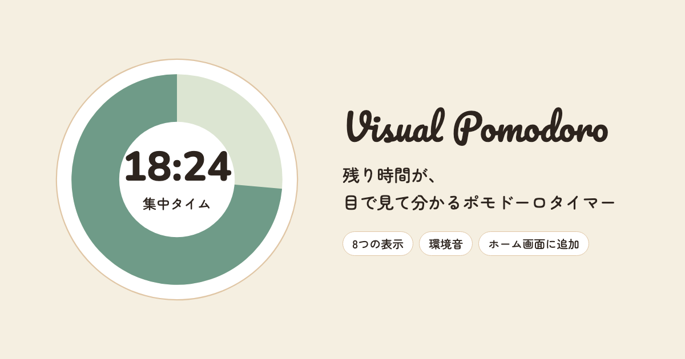

# Visual Pomodoro

残り時間が「目で見て分かる」ポモドーロタイマーです。
キーボードをほぼ使わず、**音声入力とAIエージェントへの指示（Voice Driven Development）** だけで、要件定義から実装・デプロイまで作りました。

**アプリ**：https://pomodoro-timer-teal-one.vercel.app/

## 使い方

1. 「**25**分集中して、**5**分休む」の数字を、好きな分数に書き換える
2. 上のアイコンで、好きな表示を選ぶ
3. 「スタート」を押す（スペースキーでもスタート・一時停止できます）

集中が終わると自動で休憩に、休憩が終わると自動で集中に切り替わります。「休憩に入る」／「集中に戻る」で途中から切り替えることもできます。

## 8つの表示

集中は緑、休憩は茶色です。どの表示も、残り時間に合わせてなめらかに動きます。

| 表示 | 集中 | 休憩 |
|---|---|---|
| 円 | TIME TIMER風の扇形が減っていく | 同じく扇形が減っていく |
| バー | 20本のバーが右から消えていく（1本＝設定時間の1/20） | 同じ |
| 砂時計 | 砂が落ちていく | 切り替わる時に180度回転して、また落ち始める |
| 空 | 太陽が昇って沈む（昼の空） | 三日月が昇って沈む（星空） |
| 植物 | 芽が伸びて葉が増え、最後に花が咲く | 花屋さんが花を切って花束にし、お客さんに手渡す。お客さんはうれしそうに帰っていく |
| ろうそく | 火がゆらぎながら短くなる | 火が消えて、煙がだんだん薄くなる |
| コーヒー | ドリッパーからカップにたまっていく | 湯気を立てながら減っていく |
| 本 | ページが1枚ずつめくれていく | 本を閉じて、しおりが揺れる |

## そのほかの機能

- **BGM**：集中中はブラウンノイズ、休憩中は森の環境音（小鳥のさえずり）。切り替えは2秒かけてなめらかにつながります。右上のスピーカーのアイコンでオン・オフできます。
- **設定を覚える**：分数、表示、BGMのオン・オフは、次に開いた時もそのままです（ブラウザに保存）。
- **ホーム画面に追加（PWA）**：iPhoneはSafariの共有ボタン →「ホーム画面に追加」、Android／PCのChromeはインストールボタンから。アプリのように全画面で開き、一度開けばオフラインでも起動できます。
- **裏のタブでもずれない**：残り時間は「終了予定時刻」から計算しています。タブのタイトルにも残り時間が出ます。
- **使いやすさへの配慮**：キーボード操作、読み上げ（画面リーダー）、動きを減らす設定に対応しています。

## 技術

- HTML / CSS / JavaScript のみ（フレームワークなし）
- 表示：SVG（円・砂時計・空）とCanvas（植物・ろうそく・コーヒー・本）
- 音：Web Audio API で、その場でノイズや鳥の声を作っています（音声ファイルは使っていません）
- PWA：Web App Manifest と Service Worker
- デザイン：7色だけのパレット（セージグリーンとサンド）、フォントは Pacifico（タイトル）・Nunito（数字）・Zen Maru Gothic（文字）

## これまでの流れ

- **v1（2026-08-29）**：音声入力とAIだけで、円とバーの表示・環境音のタイマーを作って公開。
- **v2（2026-09-29〜30）**：Anthropic公式の `frontend-design` スキルと自作の `design_system` スキルで見た目を作り直し、表示を8つに。ボールやドラムの表示も作ってみましたが、使い心地を見て外しました。PWA対応、BGMのオン・オフ、設定の記憶を追加。

作成：Ushi（[note](https://note.com/ushi5432)）
